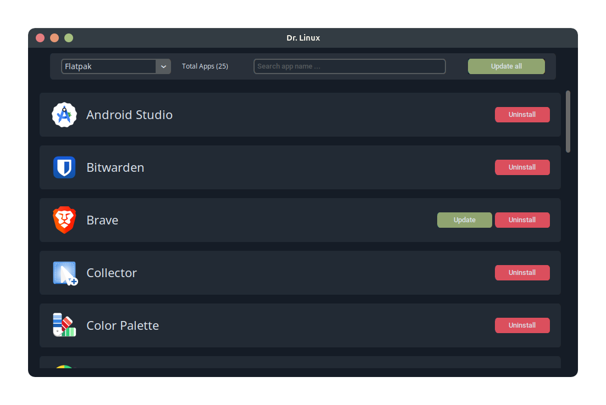

<div align="center">

<h2>DR. LINUX</h2>
<div>
<div align="center">

  


<div>

| Linux App Manager GUI |
|-----------------------|

# Dr.Linux

Linux App Manager GUI is a user-friendly software for managing Linux applications through a graphical user interface. It supports application installation, uninstallation, and updates using package managers like Flatpak, APT, Snap, and DEB files. 



## Features

- **List Installed Applications:** Displays all installed applications on your Linux system.
- **Uninstallation:** Allows easy removal of applications via the GUI.
- **Update Applications:** Checks for available updates and provides options to update applications directly from the GUI.
- **Integration:** Supports Flatpak, APT, Snap, and DEB packages.
- **Real-time Updates:** Displays updated lists after any changes (installations or removals).

## Installation

1. Clone the repository:
   ```bash
   git clone https://github.com/your-username/linux-app-manager.git
   cd linux-app-manager
   ```

2. Install dependencies:
   ```bash
   sudo apt update
   sudo apt install python3 python3-tk
   ```

3. Run the application:
   ```bash
   python3 main.py
   ```

## Usage

1. Launch the application.
2. Use the navigation menu to explore installed applications, uninstall unwanted apps, or check for updates.
3. Select an application to perform the desired action (install/uninstall/update).

## Requirements

- Python 3.6+
- Tkinter (usually included with Python installations)
- Linux distribution with APT, Flatpak installed

## Contributing

1. Fork the repository.
2. Create a new branch for your feature:
   ```bash
   git checkout -b feature-name
   ```
3. Commit your changes:
   ```bash
   git commit -m "Add new feature"
   ```
4. Push to the branch:
   ```bash
   git push origin feature-name
   ```
5. Open a pull request.


# My Project
